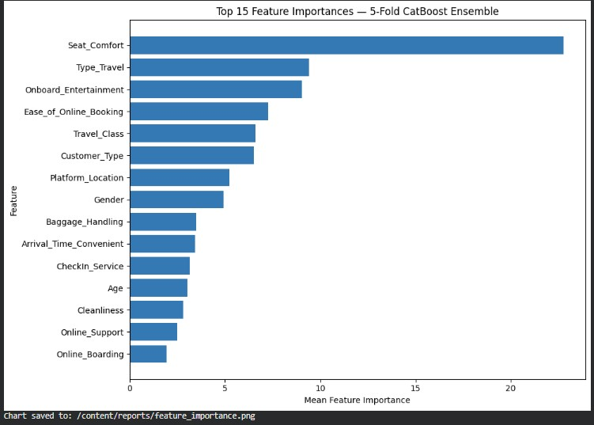
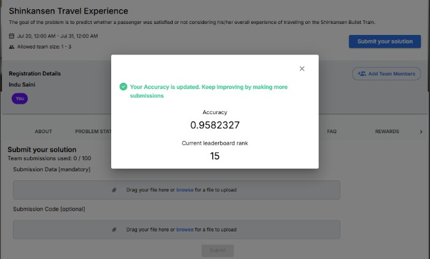

# shinkansen-passenger-satisfaction
Machine learning project to predict passenger satisfaction with the Shinkansen travel experience using CatBoost.

# 🚄 Shinkansen Passenger Satisfaction Prediction

Predicting passenger satisfaction for the Shinkansen Bullet Train using Machine Learning and CatBoost.


---

## 📊 Feature Importance



---

## 🏆 Competition Result



# 🏆 Project Results

| Metric | Score |
|---------|-------:|
| 5-Fold Cross Validation Accuracy | **95.825%** |
| Competition Leaderboard Accuracy | **95.82327%** |
| Leaderboard Rank | **15** |

The close agreement between cross-validation and leaderboard accuracy demonstrates that the model generalizes well to unseen data.

# 📌 Project Overview

This project develops a machine learning model to predict whether a passenger is satisfied with their overall travel experience on the Shinkansen Bullet Train.

The objective is to classify passengers into:

- **1** → Satisfied
- **0** → Not Satisfied

The project follows an end-to-end machine learning workflow, including data preprocessing, exploratory data analysis, feature engineering, model development, cross-validation, model interpretation, and business recommendations.

---

# 🎯 Business Objective

The goal is to identify the key drivers of passenger satisfaction and build a predictive model that can help transportation providers:

- Improve passenger satisfaction
- Enhance service quality
- Understand customer expectations
- Support data-driven operational decisions

---

# 📂 Dataset

The project combines two datasets:

- Travel Data
- Survey Data

Target Variable

**Overall_Experience**

- 1 → Satisfied
- 0 → Not Satisfied

> The original competition dataset is not included in this repository.

---

# ⚙️ Project Workflow

- Business Understanding
- Data Cleaning & Validation
- Exploratory Data Analysis (EDA)
- Feature Engineering
- CatBoost Modeling
- Stratified 5-Fold Cross Validation
- Model Evaluation
- Feature Importance Analysis
- Business Insights
- Final Submission

---

# 🤖 Machine Learning Model

The final model uses:

- CatBoostClassifier
- Stratified 5-Fold Cross Validation
- Early Stopping
- Probability Averaging Ensemble
- Classification Threshold = 0.50

Several feature engineering experiments were evaluated. Although some improved a single validation split, the original baseline feature set achieved the strongest cross-validation performance and was selected as the final solution.
---

# 📈 Model Performance

| Metric | Result |
|---------|-------:|
| 5-Fold Cross Validation Accuracy | **95.825%** |
| Competition Leaderboard Accuracy | **95.82327%** |
| Leaderboard Rank | **15** |

The close agreement between cross-validation and leaderboard accuracy indicates that the validation strategy provided a reliable estimate of model performance on unseen data.

# 📊 Most Important Features

The CatBoost model identified the following variables as the strongest predictors of passenger satisfaction:

1. Seat Comfort
2. Type of Travel
3. Onboard Entertainment
4. Ease of Online Booking
5. Travel Class
6. Customer Type
7. Platform Location
8. Baggage Handling
9. Arrival Time Convenient
10. Check-In Service

Seat Comfort was the most influential feature by a significant margin. 

---

# 💼 Business Insights

Key findings from the final model include:

- Seat comfort is the strongest driver of passenger satisfaction.
- Travel purpose significantly influences passenger expectations.
- The digital booking experience affects overall satisfaction before the journey begins.
- Travel class and customer type contribute to different satisfaction patterns.
- Platform convenience, cleanliness, baggage handling, and onboard services all influence the overall travel experience. 

---

# 💡 Business Recommendations

Based on the model results:

- Prioritize improvements in seat comfort.
- Segment services by travel purpose and customer type.
- Improve the online booking and boarding experience.
- Maintain high standards for onboard services and cleanliness.
- Monitor service quality separately across travel classes.
- Improve station and platform accessibility and convenience. 

---

# 📁 Repository Structure

```text
shinkansen-passenger-satisfaction/
│
├── notebooks/
├── reports/
├── data/
├── models/
├── images/
├── submissions/
│
├── README.md
├── requirements.txt
├── LICENSE
└── .gitignore
```

---

# 🛠 Technologies Used

- Python
- Pandas
- NumPy
- Matplotlib
- Scikit-learn
- CatBoost
- Google Colab
- GitHub

---

# 🚀 Future Improvements

Potential future work includes:

- Hyperparameter optimization
- Model stacking and blending
- LightGBM/XGBoost comparison
- SHAP value interpretation
- Deployment as a web application

---

# 📄 License

This project is released under the MIT License.

---

# 👤 Author

**Induk K Saini**

GitHub: https://github.com/IndukSaini
